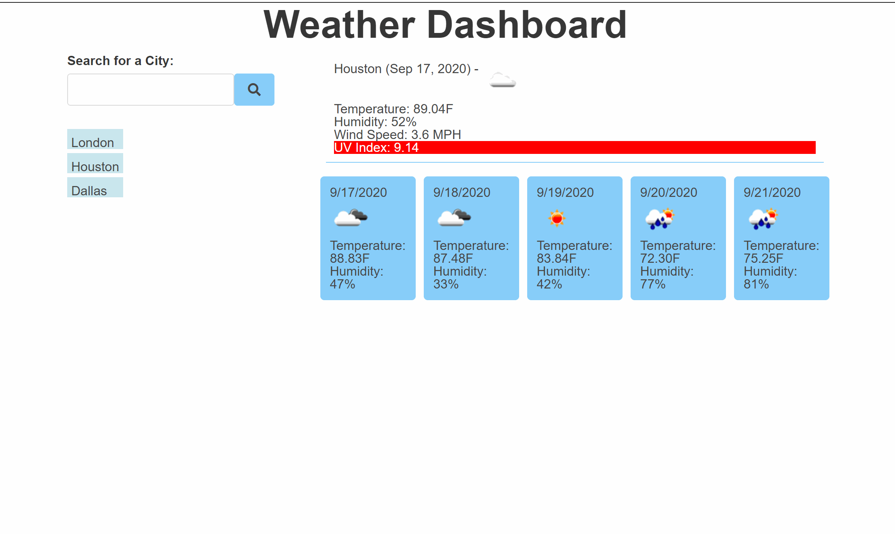

# Weather Dashboard

"Weather Dashboard" is a dynamic weather dashboard based on city search, which displays the current weather and five-day forecast of the lattest searched city. User can search and store previous searches.

## Tools
- HTML5
- CSS
- JavaScript
- jQuery
- Moment.js
- OpenWeatherMap API

## Access and Installation
Access live app: [caersun.github.io/weatherdash](https://caersun.github.io/weatherdash/)

To install and run site locally, intilize with npm install or npm i. Then in the root directory run npm start.

## View

## License
Licensed under the MIT license

## Contact Me
- [Email](i.cynthiagarcia@gmail.com)  
- [Portfolio](https://caersun.github.io/portfolio/)
